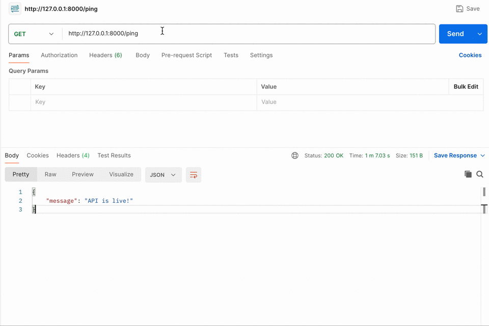

# FastAPI ML Prediction API

A lightweight FastAPI application for serving machine learning predictions via HTTP.

## Setup

- ### Clone `https://github.com/amitesh786/FastAPI-ML` or create your project directory
    - `cd FastAPI-ML`

- ### Project Structure

- FastAPI-ML/
- ├── fastml/          # Virtual environment (excluded from version control)
- ├── mlapi.py         # Main FastAPI application 
- ├── rfmodel.pkl      # Trained ML model 
- └── README.md        # Documentation

- ### Create and activate a virtual environment
    - `python3 -m venv fastml`
    - `source fastml/bin/activate`

- ### Install dependencies
    - `pip install numpy==1.23.5 scikit-learn==1.1.3 pandas fastapi uvicorn`

- ### Installing from requirements.txt
    - `pip install -r requirements.txt`

- ### Dependencies section
    - Let users install all dependencies in one go: `pip freeze > requirements.txt`

## Run the API
- `python -m uvicorn mlapi:app --reload`

    - **Ping GET**: `http://127.0.0.1:8000/ping` - Checks if the API is live.
        - Response : `{
                "message": "API is live!"
            }`
    - **POST /**: `http://127.0.0.1:8000` - Submit data for prediction.
        - Request Body (JSON):
            - `{
                    "YearsAtCompany": 5,
                    "EmployeeSatisfaction": 1,
                    "Position": "Manager",
                    "Salary": 2.0
                }`
        - Response : `{
                "prediction": 1
            }`

## Test the API

- Example request (using curl or Postman):
    - `curl -X POST "http://127.0.0.1:8000/" -H "Content-Type: application/json" -d '{
        "YearsAtCompany": 3,
        "EmployeeSatisfaction": 4.2,
        "Position": "Manager",
        "Salary": 2
    }'`

## Demo

## Common Issues

- **ModuleNotFoundError**: Ensure your `virtualenv` is activated before running anything.
- **Binary Incompatibility Errors** (`numpy.dtype size changed`): 
    - Likely due to version mismatch between model training and current environment.
    - Recreate environment using exact versions.

## Files

- `mlapi.py` – FastAPI app with prediction endpoint.
- `rfmodel.pkl` – Pre-trained ML model.

## Notes

- Make sure `rfmodel.pkl` was trained using the same scikit-learn and numpy versions.
- If you face issues like numpy dtype size changed, recreate the virtualenv with matching versions.

## 🧑‍💻 Developer Setup
- Clone the repository: `git clone https://github.com/amitesh786/FastAPI-ML`

## 👨‍💻 Author Amitesh Singh – [GitHub](https://github.com/amitesh786)
- Feel free to contribute or suggest improvements! 🙌
